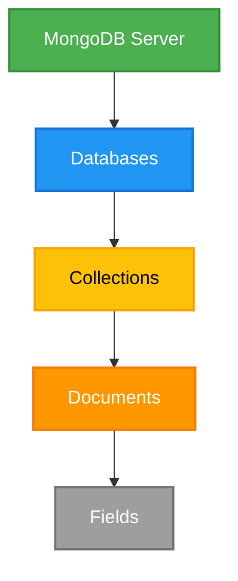

# Day 1: MongoDB Setup and Basic Operations

## 📝 Overview
First day of MongoDB exploration, covering installation verification, basic database operations, and collection management.

## 🛠️ Environment Setup
- **PowerShell Version**: 7.5.2
- **MongoDB Version**: 8.0.12
- **MongoDB Shell (mongosh)**: 2.5.6

## ✅ Installation Verification

### Check MongoDB Server Version
```powershell
mongod --version
```

### Start MongoDB Shell
```powershell
mongosh
```

## 📊 Database Operations

### MongoDB Hierarchy


#### Legend:
- **MongoDB Server**: The main database server that can host multiple databases
- **Databases**: Logical containers for collections (e.g., 'admin', 'local', 'students')
- **Collections**: Similar to tables in relational databases, contains documents
- **Documents**: JSON-like BSON documents that store data
- **Fields**: Key-value pairs within documents (e.g., 'name', 'age', 'email')

### Show All Databases
```javascript
show dbs
```

### Switch to/Create a Database
```javascript
use database_name
// Example:
use students
```

### Show Current Database
```javascript
db
```

### Drop Current Database
```javascript
db.dropDatabase()
```

## 📑 Collection Operations

### Create a Collection
```javascript
db.createCollection('collection_name')
// Example:
db.createCollection('data')
```

### Show Collections in Current Database
```javascript
show collections
```

### Drop a Collection
```javascript
db.collection_name.drop()
// Example:
db.data.drop()
```

## 🔍 Observations
1. MongoDB automatically creates a database when you first store data in it
2. The `local` database is created by default for internal use
3. The `admin` database is used for administration purposes
4. Collections are created implicitly when you first insert data

## 📋 Example Session
```javascript
// Show all databases
show dbs

// Switch to students database
use students

// Create a new collection
db.createCollection('grades')

// Show collections in current database
show collections

// Drop the collection
db.grades.drop()

// Drop the entire database
db.dropDatabase()
```

## ⚠️ Common Issues
1. **Access Control Warning**:
   ```
   Access control is not enabled for the database. Read and write access to data and configuration is unrestricted
   ```
   - This is a security warning indicating that authentication is not enabled
   - For production environments, always enable access control

2. **Screen Reader Warning**:
   ```
   Warning: PowerShell detected that you might be using a screen reader and has disabled PSReadLine
   ```
   - To re-enable PSReadLine: `Import-Module PSReadLine`

## 🔜 Next Steps
- [ ] Enable authentication
- [ ] Learn about document insertion and queries
- [ ] Explore CRUD operations in detail
